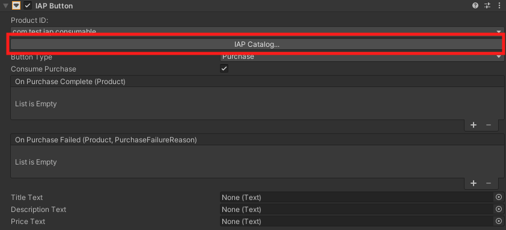
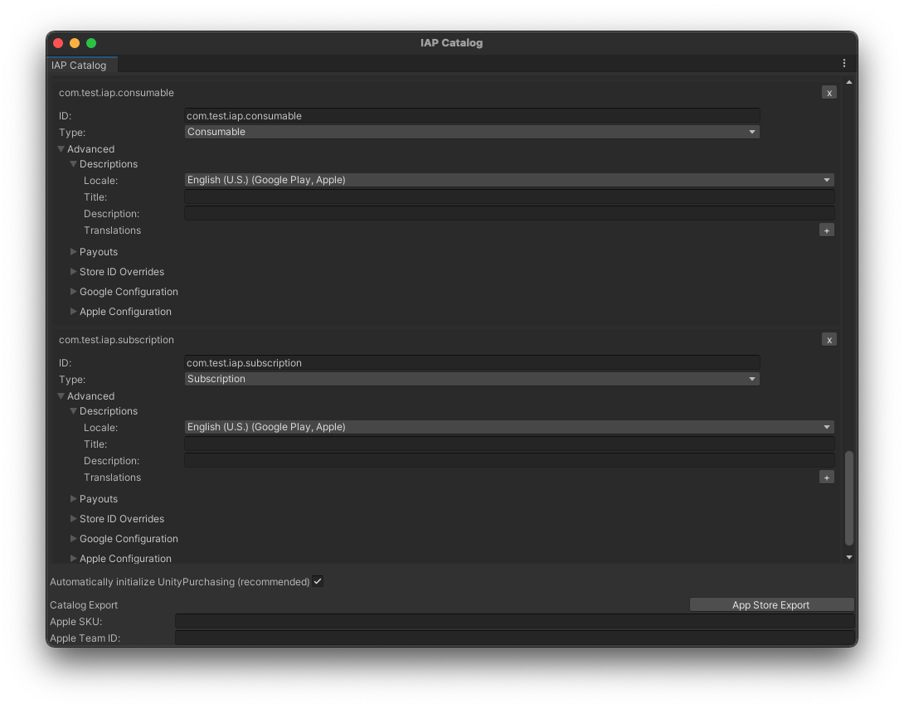
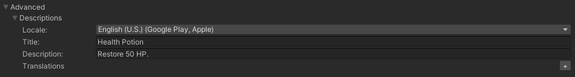
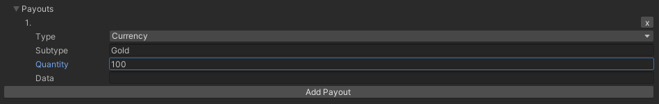
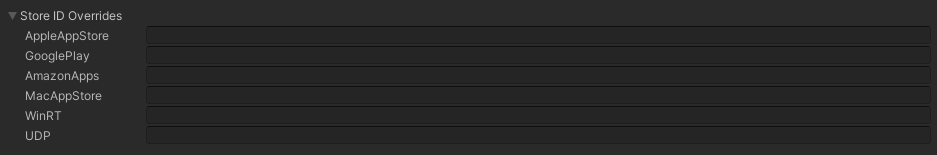
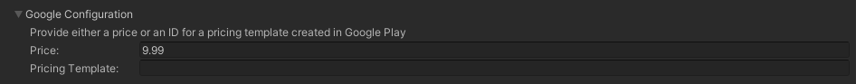
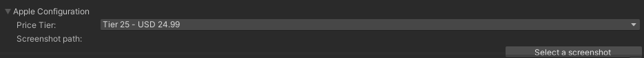

# IAP Catalog

To open the __IAP Catalog__ GUI one of two ways:
 
* Select  __Window &gt; Unity IAP &gt; IAP Catalog__.
* Or, with your __IAP Button__ selected, locate its __IAP Button (Script)__ component in the Inspector, then click __IAP Catalog…__. 

## Populating Products in the IAP Catalog

Next, use the GUI to define the following attributes for each Product in your catalog.

* A __Product ID__ with which to communicate to app stores (note that you can override this ID with unique store-specific IDs through the __Advanced__ option).
* A __Product Type__ (__Consumable__, __Non-Consumable__, or __Subscription__).

**Note:** 
- The __IAP Catalog__ GUI provides additional tools for configuring your Products. Before [exporting a catalog](#Exporting-to-an-app-store) for upload to its respective store, you must populate description and pricing information as well.
- The __IAP Catalog__ acts as a Product catalog dictionary, not as an inventory manager. You must still implement the code that handles conveyance of the purchased content.

## Advanced
This section defines the metadata associated with your Product for use in an in-game store.

### Descriptions
This sections defines the [descriptions of a product](DefiningProductsOverview.md#Descriptions).

Add __Translations__ for the __Title__ and __Description__ fields by clicking the plus (__+__) icon and selecting an additional locale. You can add as many translations as you like.

### Payouts
This sections defines the [payout of a product](DefiningProductsOverview.md#Payouts). 

### Store ID Overrides
This sections defines the [Store ID overrides of a product](DefiningProductsOverview.md#Store-ID-Overrides).

### Google Configuration (required for Google Play export)
Provide either a Product price, or an ID for a [Pricing Template](https://support.google.com/googleplay/android-developer/answer/6334373) created in Google Play.

### Apple Configuration (required for Apple export)
Select a **Pricing Tier** from the dropdown menu. Unity supports predefined Apple price points, but not arbitrary values.

__Select a screenshot__ to upload. 

For information on screenshot specs, see Apple’s publisher support documentation.

### Exporting to an app store
In order for purchases to function, you must configure your catalog on the corresponding app store. To do so, you can export your Product Catalog as a CSV file to Google Play, or as an XML file through Apple’s Application Loader to the iTunes Store.

#### Google Play
To export your Product Catalog for Google Play:

1. In the __IAP Catalog__ window (__Window &gt; Unity IAP &gt; IAP Catalog__), ensure that each Product has the following defined: * __ID__  * __Type__  * __Title__ and __Description__  * __Price__ or __Pricing Template__ ID
2. Scroll down, and select __App Store Export__.
3. Select __Google Play CSV__.
4. Choose a location in which to save the CSV file.

For complete guidance on uploading your exported catalog to Google Play, see the [Google in-app billing](https://developer.android.com/google/play/billing/billing_admin.html#billing-list-setup) documentation on the [Android Developers website](https://developer.android.com).

#### Apple App Store
To export your Product Catalog for Apple App Store:

1. In the **IAP Catalog** window (**Window** &gt; **Unity IAP** &gt; **IAP Catalog**), ensure that each Product has the following defined: * **ID**  * **Type**  * **Title** and **Description**  * **Price Tier** and **Screenshot path**  *
   **Apple SKU** (found in [iTunes Connect](https://itunesconnect.apple.com))  * **Apple Team ID** (found on [Apple’s developer website](https://developer.apple.com))
2. Scroll down, and select **App Store Export**.
3. Select **Apple XML Delivery**.
4. Choose a location in which to save the XML file.

For complete guidance on importing through Apple’s Application Loader, see the [Application Loader](https://itunesconnect.apple.com/docs/UsingApplicationLoader.pdf) documentation on the [iTunes Connect website](https://itunesconnect.apple.com).
