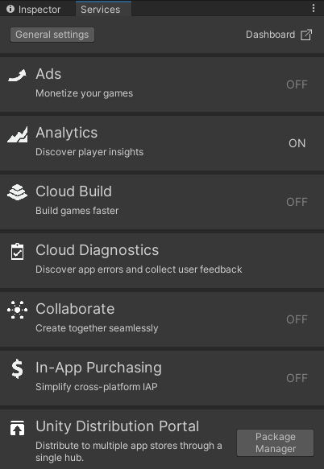
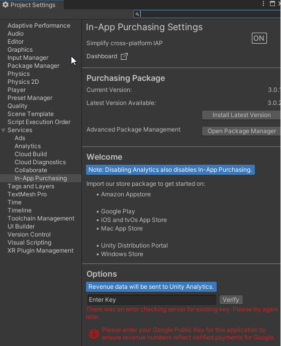

# Getting Started

## Finding and Enabling In-App Purchasing in the Service window
1. Open your Unity project in the Unity Editor.
2. From the menu, go to **Window** > **General** > **Services** to open the **Services** window.
3. Create a Project ID, then connect the project to an organization.
4. Answer the COPPA compliance questions.
5. The **Services** window displays a list of services. Click **In-App Purchasing**.

6. The **Project Settings** window opens.

7. Click the toggle next to **In-App Purchasing Settings** to **ON**.

This will automatically install the IAP package from the Package Manager, providing you with new features and menu items to help you manage IAP.  