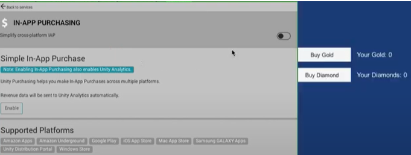
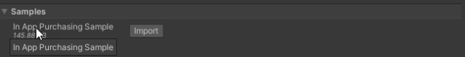

## Overview

This document explains how to activate **In-App Purchasing** (IAP).

The Unity IAP package provides coded and codeless approaches that you set up to:
- Allow users to buy items in your games.
- Connect to stores so you can obtain revenue from these purchases.

Here is an overview of the steps to get IAP working in your project:

- Define your in-app purchase strategy for this game.
- Set up your project to use Unity Services.
- Activate IAP to automatically install the package.
- Configure settings.
- Create and catalog your in-game items that you want to sell.
- Use the Codeless IAP button to give users a way to buy items. Then, once you have the logic working, consider customizing the button look and feel or use the scripted IAP for a rich API to enhance this process. 
- Connect your app to your chosen app stores, such as Google or Apple.
- Add items to the app stores.

## Next Steps

### Define your In-App Purchase strategy

Your task will be to create items for players to buy and obtain their identifiers.

To make this happen behind the scenes, you must tie Product ID to each item you are selling using a specified format. Some stores require that you customize the **Product ID** for their stores.

#### Planning:

Before you create your products, consider how you will define the following in your stores:

- Your strategy to determine when and how users can buy items.
- Your pricing strategy.
- The types of products (consumable, non-consumable, subscription).

## Store Extensions

Stores may offer unique functionality that does not fit into the normal cross-platform purchase flow. This extended functionality is accessed via the ``IExtensionProvider`` which is provided to your application when Unity IAP initializes successfully.

It is not necessary to use platform-dependent compilation when using extensions; each extension comes with a fake no-op implementation which is used when running on a platform that does not offer the extended functionality.

More information can be found in the `Stores` section of this manual

## Learn more

#### IAP Samples

1. From the **IAP Project Settings Page**, click **Open Package Manager** from **Options**.
2. Navigate to **In App Purchasing**. On the right information panel, find **Samples**.
3. Expand **Samples**, then click **Import**.

#### Forum tutorials

[See the Unity forum](https://forum.unity.com/threads/sample-iap-project.529555/).

#### Unity Learn IAP classes

[Refer to the Unity Learn IAP classes](https://learn.unity.com/tutorial/unity-iap) for more guidance. 
