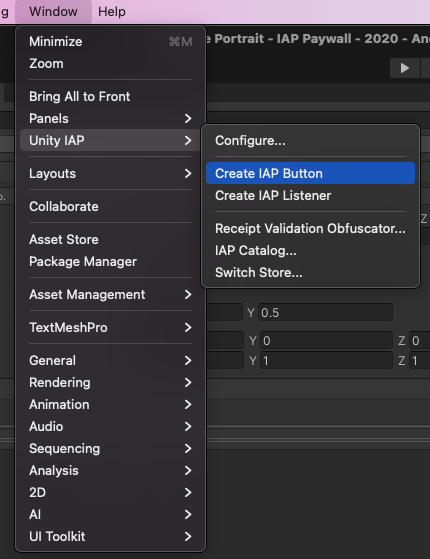
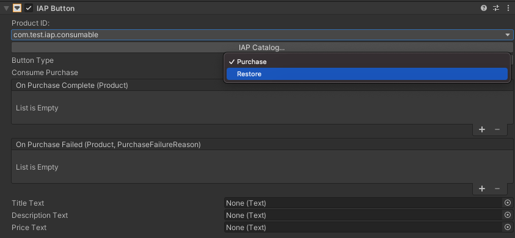

# IAP Button

IAP Button is a way to purchase or restore products without writing code.

## Adding IAP Button to the Scene

To add an __IAP Button__ to your Scene, in the Unity Editor, select __Window &gt; Unity IAP &gt; Create IAP Button__.

## Restore Button
Some app stores, including iTunes, require apps to have a __Restore__ button. Codeless IAP provides an easy way to implement a restore button in your app.

To add a __Restore__ button:

1. Add an __IAP Button__ to your Scene (**Window** &gt; **Unity IAP** &gt; **Create IAP Button**).
2. With your __IAP Button__ selected, locate its **IAP Button (Script)** component in the Inspector, then select **Restore** from the **Button Type** drop-down menu (most of the component's other fields will disappear from the Inspector view).
   

When a user selects this button at run time, the button calls the purchase restoration API for the current store. This functionality works on the iOS App Store, the Mac App Store and the Windows Store. You may want to hide the __Restore__ button on other platforms.

If the restore succeeds, Unity IAP invokes the __On Purchase Complete (Product)__ function on the __IAP Button__ associated with that Product.
