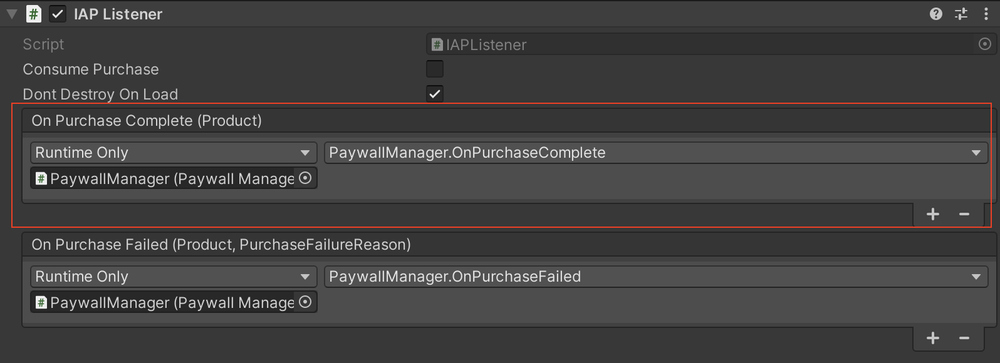
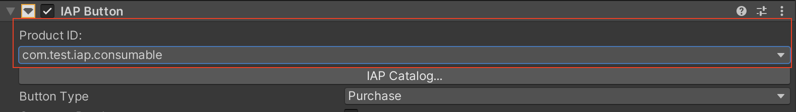
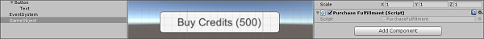
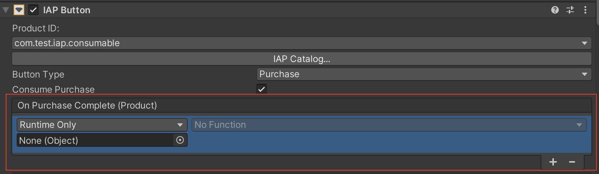

# IAP Listeners
Codeless IAP dispatches successful and failed purchase events to an active __IAP Button__ component in the hierarchy. However, there may be times when it is difficult or undesirable to have an active __IAP Button__ when handling a successful purchase. For example, if a purchase is interrupted before completing, Unity IAP attempts to process the purchase again the next time it is initialized. You may want this to happen immediately after the app launches, in which case an __IAP Button__ wouldn't make sense. Codeless IAP includes the __IAP Listener__ component precisely for these cases. An active __IAP Listener__ in the Scene hierarchy receives any purchase events that cannot be dispatched to an __IAP Button__.

To add an __IAP Listener__:

1. In the Unity Editor, select __Window &gt; Unity IAP &gt; Create IAP Listener__.
2. Follow the steps for [writing a purchase fulfillment script as a GameObject component](#purchase-fulfillment).
3. Select the __IAP Listener__ in the Scene and locate its **IAP Listener (Script)** component in the Inspector, then click the plus (**+**) button to add a function to the **On Purchase Complete (Product)** list.
4. Drag the GameObject with the purchase fulfillment script onto the event field in the component’s Inspector, then select your function from the dropdown menu.
   

## Purchase fulfillment
When your catalog contains at least one Product, you can define __IAP Button__ behavior when the purchase completes or fails.

1. Select your __IAP Button__ in the Scene view, then locate its __IAP Button (Script)__ component in the Inspector.
2. Select the Product to link to the __IAP Button__ from the __Product ID__ drop-down list.
   
3. Create your own function that provides purchase fulfillment, or import an Asset that does this (see code sample, below).
4. Apply your purchase fulfilment script to a GameObject as a component.
   
5. Return to the  __IAP Button (Script)__ component in the Inspector, and click the plus (__+__) button to add a function to the __On Purchase Complete (Product)__ list.
6. Drag the GameObject with the purchase fulfillment script onto the __On Purchase Complete (Product)__ event field (illustrated below), then select your function from the dropdown menu.
   

**Fulfillment script code sample**:

```
public void GrantCredits (int credits){
    userCredits = userCredits + credits;
    Debug.Log(“You received “ + credits “ Credits!”);
} 
```

Run your game to test the __IAP Button__.
