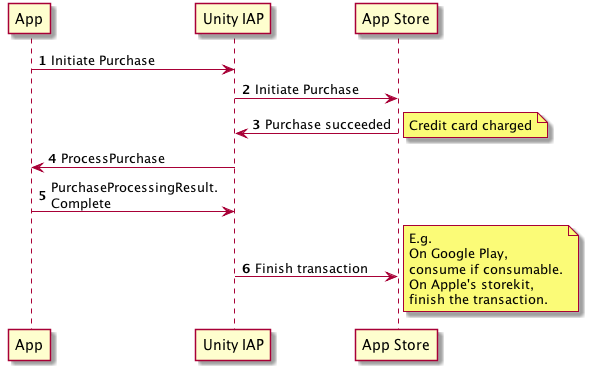
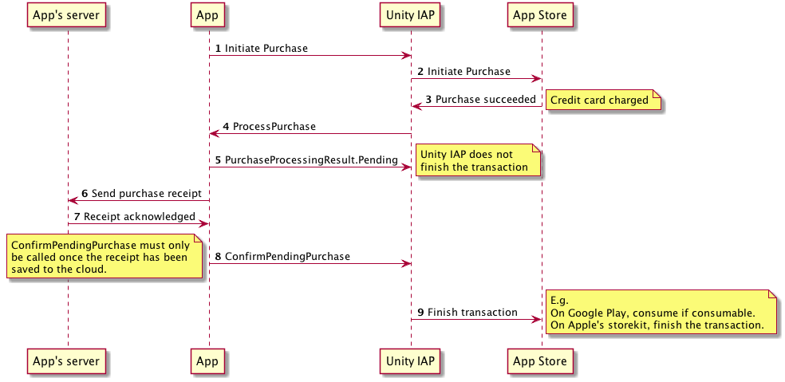

# Processing Purchases

The `ProcessPurchase` function of your store listener is called when a purchase completes. Your application should fulfil whatever the user has bought; for example, unlocking local content or sending purchase receipts to a server to update a server-side game model.

A result is returned to indicate whether or not your Application has finished processing the purchase:

|Result|Description|
|:---|:---|
|__PurchaseProcessingResult.Complete__|The application has finished processing the purchase and should not be informed of it again.|
|__PurchaseProcessingResult.Pending__|The application is still processing the purchase and ProcessPurchase will be called again the next time the Application starts, unless the `ConfirmPendingPurchase` function of `IStoreController` is called.|

Note that ProcessPurchase may be called at any point following a successful initialization. If your application crashes during execution of the ``ProcessPurchase`` handler, then it is invoked again the next time Unity IAP initializes, so you may wish to implement your own additional de-duplication.

## Reliability

Unity IAP requires explicit acknowledgement of purchases to ensure that purchases are reliably fulfilled in the event of network outages or application crashes. Any purchases that complete while the application is offline will be sent to the application on next initialization.

### Completing purchases immediately

When `PurchaseProcessingResult.Complete` is returned, Unity IAP finishes the transaction immediately (as shown in the diagram below).

You **must not** return `PurchaseProcessingResult.Complete` if you are selling consumable products and fulfilling them from a server (for example, providing currency in an online game).

If you do, there is a risk that consumable purchases will be lost if your Application is uninstalled before the cloud save takes place.

### Saving purchases to the cloud

If you are saving consumable purchases to the cloud, you **must** return `PurchaseProcessingResult.Pending` and call `ConfirmPendingPurchase` only when you have successfully persisted the purchase.

When returning `Pending`, Unity IAP keeps transactions open on the underlying store until confirmed as processed, ensuring consumable purchases are not lost even if a user reinstalls your application while a consumable is in this state.

