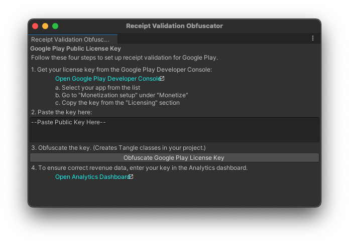

# Receipt Obfuscation

If the content that the user is purchasing already exists on the device, the application simply needs to make a decision about whether to unlock it.

Unity IAP provides tools to help you hide unpurchased content and to validate and parse receipts through Google Play and Apple stores.

## Obfuscating encryption keys

Receipt validation is performed using known encryption keys. For your application, this is an encrypted Google Play public key, and/or Apple's root certificate.

If a user can replace these, they can defeat your receipt validation checks, so it is important to make it difficult for a user to easily find and modify these keys.

Unity IAP provides a tool that can help you obfuscate your encryption keys within your Application. This confuses or jumbles the keys so that it is much harder for a user to acces them. In the Unity menu bar, go to __Window__ > __Unity IAP__ > __IAP Receipt Validation Obfuscator__.




This window encodes both Apple's root certificate (which is bundled with Unity IAP) and your Google Play public key (from the application's [Google Play Developer Console's Services &amp; APIs](https://developer.android.com/google/play/licensing/setting-up.html) page) into two different C# files: __AppleTangle__ and __GooglePlayTangle__. These are added to your project for use in the next section.

Note that you do not have to provide a Google Play public key if you are only targeting Apple's stores, and vice versa.

## Validating receipts

Use the `CrossPlatformValidator` class for validation across both Google Play and Apple stores.

You must supply this class with either your Google Play public key or Apple's root certificate, or both if you wish to validate across both platforms.

The `CrossPlatformValidator` performs two checks:

* Receipt authenticity is checked via signature validation.
* The application bundle identifier on the receipt is compared to the one in your application. An **InvalidBundleId** exception is thrown if they do not match.

Note that the validator only validates receipts generated on Google Play and Apple platforms. Receipts generated on any other platform, including fakes generated in the Editor, throw an __IAPSecurityException__.

If you try to validate a receipt for a platform that you haven't supplied a secret key for, a __MissingStoreSecretException__ is thrown.

````
public PurchaseProcessingResult ProcessPurchase (PurchaseEventArgs e)
{
    bool validPurchase = true; // Presume valid for platforms with no R.V.

    // Unity IAP's validation logic is only included on these platforms.
#if UNITY_ANDROID || UNITY_IOS || UNITY_STANDALONE_OSX
    // Prepare the validator with the secrets we prepared in the Editor
    // obfuscation window.
    var validator = new CrossPlatformValidator(GooglePlayTangle.Data(),
        AppleTangle.Data(), Application.bundleIdentifier);

    try {
        // On Google Play, result has a single product ID.
        // On Apple stores, receipts contain multiple products.
        var result = validator.Validate(e.purchasedProduct.receipt);
        // For informational purposes, we list the receipt(s)
        Debug.Log("Receipt is valid. Contents:");
        foreach (IPurchaseReceipt productReceipt in result) {
            Debug.Log(productReceipt.productID);
            Debug.Log(productReceipt.purchaseDate);
            Debug.Log(productReceipt.transactionID);
        }
    } catch (IAPSecurityException) {
        Debug.Log("Invalid receipt, not unlocking content");
        validPurchase = false;
    }
#endif

    if (validPurchase) {
        // Unlock the appropriate content here.
    }

    return PurchaseProcessingResult.Complete;
}

````

It is important you check not just that the receipt is valid, but also what information it contains. A common technique by users attempting to access content without purchase is to supply receipts from other products or applications. These receipts are genuine and do pass validation, so you should make decisions based on the product IDs parsed by the __CrossPlatformValidator__.

## Store-specific details

Different stores have different fields in their purchase receipts. To access store-specific fields, `IPurchaseReceipt` can be downcast to two different subtypes: `GooglePlayReceipt` and `AppleInAppPurchaseReceipt`.

````
var result = validator.Validate(e.purchasedProduct.receipt);
Debug.Log("Receipt is valid. Contents:");
foreach (IPurchaseReceipt productReceipt in result) {
	Debug.Log(productReceipt.productID);
	Debug.Log(productReceipt.purchaseDate);
    Debug.Log(productReceipt.transactionID);

	GooglePlayReceipt google = productReceipt as GooglePlayReceipt;
	if (null != google) {
		// This is Google's Order ID.
		// Note that it is null when testing in the sandbox
		// because Google's sandbox does not provide Order IDs.
		Debug.Log(google.transactionID);
		Debug.Log(google.purchaseState);
		Debug.Log(google.purchaseToken);
	}

	AppleInAppPurchaseReceipt apple = productReceipt as AppleInAppPurchaseReceipt;
	if (null != apple) {
		Debug.Log(apple.originalTransactionIdentifier);
		Debug.Log(apple.subscriptionExpirationDate);
		Debug.Log(apple.cancellationDate);
		Debug.Log(apple.quantity);
	}
}
````

## Parsing raw Apple receipts

Use the `AppleValidator` class to extract detailed information about an Apple receipt. Note that this class only works with iOS App receipts from version 7.0 onwards, not Apple's deprecated transaction receipts.

````
#if UNITY_ANDROID || UNITY_IOS || UNITY_STANDALONE_OSX
var builder = ConfigurationBuilder.Instance(StandardPurchasingModule.Instance());
// Get a reference to IAppleConfiguration during IAP initialization.
var appleConfig = builder.Configure<IAppleConfiguration>();
var receiptData = System.Convert.FromBase64String(appleConfig.appReceipt);
AppleReceipt receipt = new AppleValidator(AppleTangle.Data()).Validate(receiptData);

Debug.Log(receipt.bundleID);
Debug.Log(receipt.receiptCreationDate);
foreach (AppleInAppPurchaseReceipt productReceipt in receipt.inAppPurchaseReceipts) {
	Debug.Log(productReceipt.transactionIdentifier);
	Debug.Log(productReceipt.productIdentifier);
}
#endif
````

The `AppleReceipt` type models Apple's ASN1 receipt format. See [Apple's documentation](https://developer.apple.com/library/ios/releasenotes/General/ValidateAppStoreReceipt/Chapters/ReceiptFields.html#/apple_ref/doc/uid/TP40010573-CH106-SW1) for an explanation of its fields.
