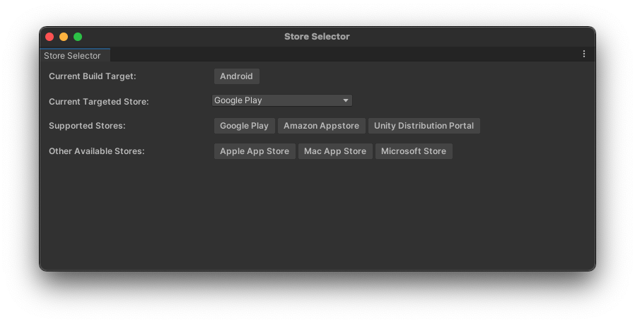

# Store Selector

## Using Unity Editor

The In-App Purchasing package supplies a tool to select the desired store when building. To access this tool open the Unity Editor and in the top menu click on `Services / Unity IAP / Switch Store...`.

In case Unity does not show a `Services` menu, set the target store using `Window > Unity IAP > Switch Store...`.

A new window will appear and in this window there are 4 important fields.


#### Current Build Target
This field is not modifiable and shows the current selected build target in `Build Settings` under `File / Build Settings...`.

#### Current Targeted Store
This field is the main feature of this windows. Changing this field will change the store that the In-App Purchasing package will build for.

This field automatically changes to list of *Supported Stores* depending on the *Current Build Target*.

#### Supported Stores
This field is not modifiable and shows the full list of supported stores for the *Current Build Target*.

#### Other Available Stores
This field is not modifiable shows the full list of supported stores for every other build target not selected.

## Using API
In the code there is an option to change the targeted store. The call looks like this:
````
UnityPurchasingEditor.TargetAndroidStore(AndroidStore.AmazonAppStore)
````