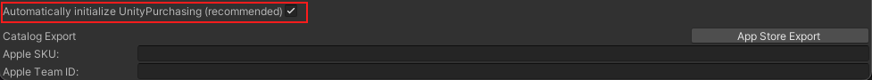

# Initialization

You must provide an implementation of the ``IStoreListener`` interface which Unity IAP uses to inform your application of purchase-related events.

Call the ``UnityPurchasing.Initialize`` method to start the initialization process, supplying your listener implementation and configuration.

Note that initialization will not fail if the network is unavailable; Unity IAP will continue attempting to initialize in the background. Initialization will only fail if Unity IAP encounters an unrecoverable problem such as a misconfiguration or IAP being disabled in device settings.

Consequently Unity IAP may take an arbitrary period of time to initialize; indefinitely if the user is in airplane mode. You should design your store accordingly by preventing users from attempting to make purchases if initialization has not completed successfully.

````
using UnityEngine;
using UnityEngine.Purchasing;

public class MyIAPManager : IStoreListener {

    private IStoreController controller;
    private IExtensionProvider extensions;

    public MyIAPManager () {
        var builder = ConfigurationBuilder.Instance(StandardPurchasingModule.Instance());
        builder.AddProduct("100_gold_coins", ProductType.Consumable, new IDs
        {
            {"100_gold_coins_google", GooglePlay.Name},
            {"100_gold_coins_mac", MacAppStore.Name}
        });

        UnityPurchasing.Initialize (this, builder);
    }

    /// <summary>
    /// Called when Unity IAP is ready to make purchases.
    /// </summary>
    public void OnInitialized (IStoreController controller, IExtensionProvider extensions)
    {
        this.controller = controller;
        this.extensions = extensions;
    }

    /// <summary>
    /// Called when Unity IAP encounters an unrecoverable initialization error.
    ///
    /// Note that this will not be called if Internet is unavailable; Unity IAP
    /// will attempt initialization until it becomes available.
    /// </summary>
    public void OnInitializeFailed (InitializationFailureReason error)
    {
    }

    /// <summary>
    /// Called when a purchase completes.
    ///
    /// May be called at any time after OnInitialized().
    /// </summary>
    public PurchaseProcessingResult ProcessPurchase (PurchaseEventArgs e)
    {
        return PurchaseProcessingResult.Complete;
    }

    /// <summary>
    /// Called when a purchase fails.
    /// </summary>
    public void OnPurchaseFailed (Product i, PurchaseFailureReason p)
    {
    }
}
````

### Automatically initializing `UnityPurchasing`
The IAP SDK must initialize in order for in-app purchasing to work. This occurs automatically when the first instance of a Codeless __IAP Button__ or [__IAP Listener__](PurchasingFlow/ProcessingPurchase/IAPListener.md) loads at run time. However, you may need to initialize the SDK before an IAP Button or IAP Listener appears in your game. In these cases, check __Automatically initialize UnityPurchasing (recommended)__ at the bottom of the __IAP Catalog__ window. This ensures that [```UnityPurchasing```](xref:UnityEngine.Purchasing.UnityPurchasing) initializes immediately when the application starts, and eliminates dependencies on the codeless instances’ lifecycles.



In order to work, your catalog must contain at least one Product.

**Note**: You can use auto-initialize together with IAP Buttons or Listeners. In this case, the SDK initializes when the game starts instead of when the first instance of an IAP Button or Listener loads in the Scene. However, you should not enable auto-initialize if you also initialize manually in a script, as this may cause errors.
