# How to Set Up

## Introduction

This guide describes the process of establishing the digital records and relationships necessary for a Unity game to interact with an In-App Purchase Store.

In-App Purchase (IAP) is the process of transacting money for digital goods. A platform's Store allows purchase of Products, representing digital goods. These Products have an Identifier, typically of string datatype. Products have Types to represent their durability: _subscription_, _consumable_ (capable of being rebought), and _non-consumable_ (capable of being bought only once) are the most common. 

## Apple App Store

### Getting Started

1. Write a game implementing Unity IAP. See [Unity IAP Initialization](../../SetupIAP/Overview.md).

1. Keep the game's product identifiers on-hand for use in App Store Connect later.

    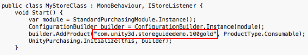

### Register the Application

1. In the [Apple Developer Center](https://developer.apple.com/account), navigate to the appropriate Identifiers section. 

2. Add a new App ID to create a fundamental application entity with Apple. 
    
    **NOTE:** Use an Explicit App ID. Wildcard App IDs (com.example.*) cannot be used for applications that use In-App Purchases.
    
    **NOTE:** The App ID is available to use in App Store Connect after you create it in the Developer Center.
  
    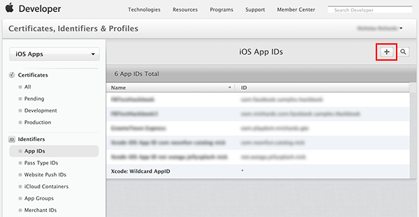

3. Navigate to [App Store Connect](https://itunesconnect.apple.com) and create an App, to establish a Store relationship with your game. 
  
    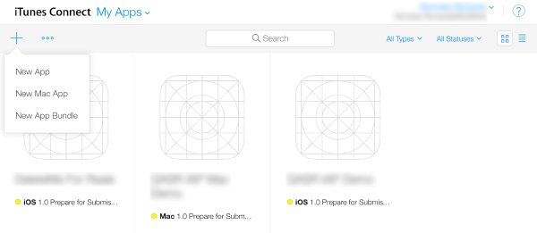 

4. Use the newly created App ID for the app's Bundle ID. 

    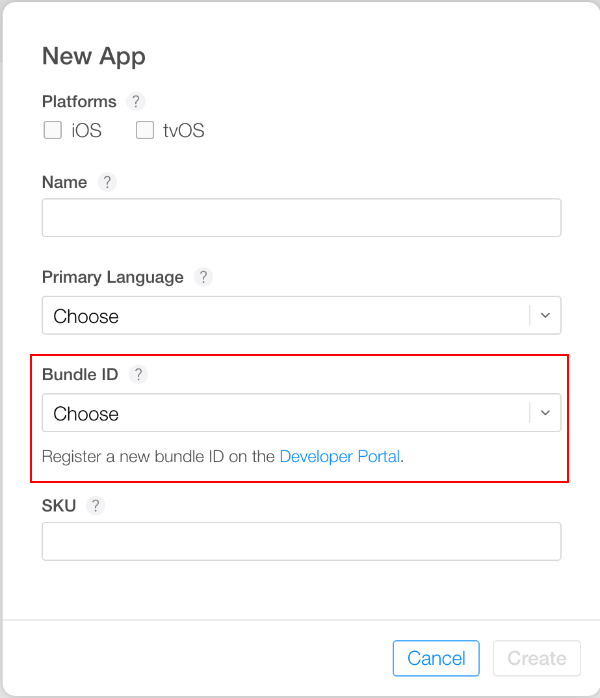

### Add In-App Purchases

1. Choose __Features__ and add a new In-App Purchase with the plus ("+") button. 

    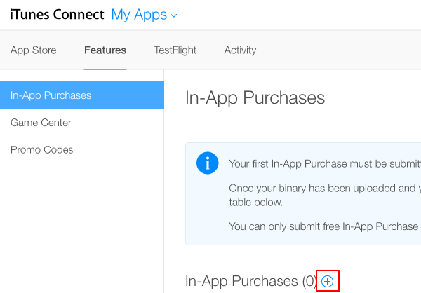

2. Choose a [Product Type](../../SetupIAP/DefiningProduct/DefiningProductsOverview.md#Product-Type). 

    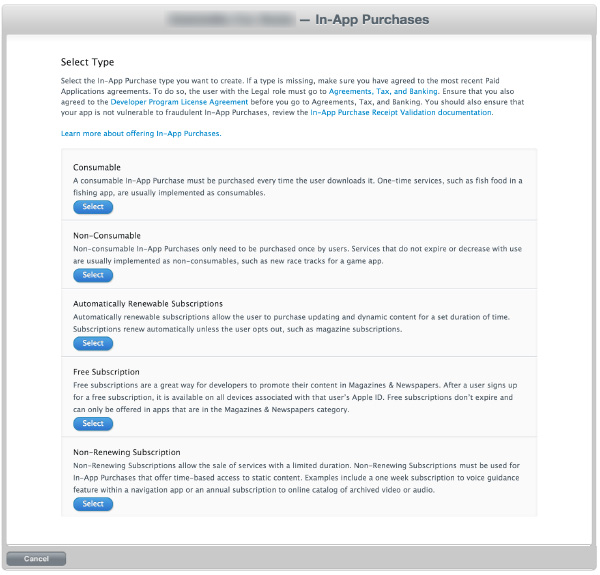

3. Specify the Product Identifier, and complete other fields as requested.

    **NOTE:** The "Product ID" here is the same identifier used in the game source code, added to the [Unity IAP ConfigurationBuilder](xref:UnityEngine.Purchasing.ConfigurationBuilder) instance via __AddProduct()__ or __AddProducts()__. 
    
    **NOTE:** When targeting multiple Apple device groups (for example, shipping on both iOS and Mac) Apple requires usage of different, unique product identifiers for each distinct device group. Use [Unity IAP's Purchasing.IDs](xref:UnityEngine.Purchasing.IDs) class and define a one-to-many mapping Product IDs to the store-specific identifiers, and pass that mapping in when initializing IAP. 

    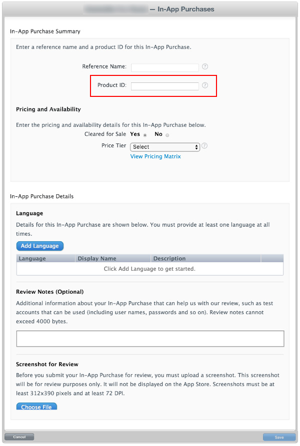

4. Result:

    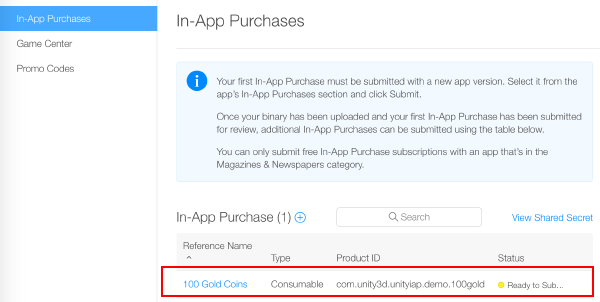

### Test IAP

1. Create __Sandbox Testers__ using App Store Connect for use on your test device's iTunes Account. To do this, navigate to __App Store Connect &gt; Users and Roles__, and choose the plus ("+") button. You must review [Apple's Sandbox Tester documentation](https://help.apple.com/app-store-connect/#/dev8b997bee1) as there are several additional important usage notes, and you must use a real email address to create Testers. 
    
    **TIP:** (*) To simplify managing the email address, use an email service capable of sub-addressing (emailaccount+subaddress@example.com) such as Gmail, iCloud, and Outlook.com. This allows one email account to receive email for multiple sub-addresses. 

    

2. Walk through the user creation wizard. 

    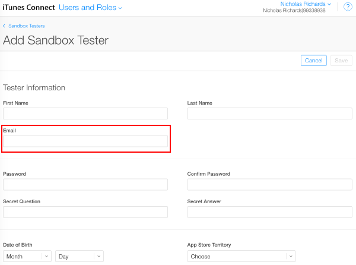

3. Build the Xcode project for your game using Unity.

    **NOTE:** Ensure the Bundle Identifier in Unity (**Edit** &gt; **Project Settings**, then select the **Other Settings** category, and navigate to the **Bundle Identifier** section) matches that used in App Store Connect.

4. Then, in your game's Xcode project, ensure the Team (Project Navigator &gt; your game Target &gt; General &gt; Identity &gt; Team) is set to that of your Apple Developer account.

    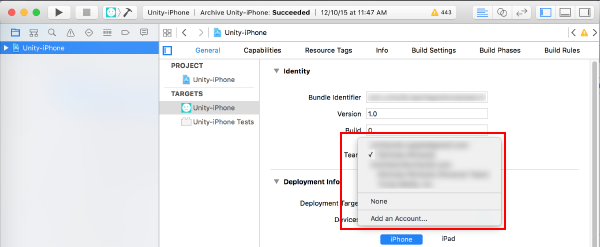

#### For iOS

1. Using the target iOS device, sign out of any existing Apple ID accounts. Only sign in as the Sandbox Tester when prompted by the app, later. Any subsequent purchases are routed through the Apple Sandbox instead of the Production Store.

    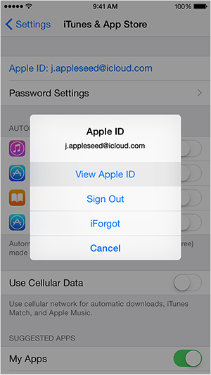

2. Build and run the game on your iOS device. `UnityPurchasing.Initialize()` succeeds if everything has been correctly configured. See [Unity Purchasing Initialization](xref:UnityEngine.Purchasing.UnityPurchasing) 

3. Test the IAP by making a purchase in the game on the device. A modified purchase dialog displays, explaining that this purchase is being performed in the Sandbox Environment. Use the Sandbox User Tester password when prompted for purchase. 

    WARNING: If the indicator is not present, then an account is charged real money for the product.
  
    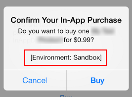

#### For Mac

1. When building a desktop Mac build, select __Mac App Store Validation__ within Unity's Mac **Player** settings.

2. Once you have built your App, update its `info.plist` file with your bundle identifier and version strings. Right click on the .app file and click __Show Package Contents__, locate the `info.plist` file and update the `CFBundleIdentifier` string to your application's bundle identifier.

3. Sign, package, and install your application. Run the following commands from an OSX terminal, filling in "your.app" and "your.pkg" appropriately.

    **TIP:** To sign the bundle, you may first need to remove the Contents.meta file if it exists: `your.app/Contents/Plugins/unitypurchasing.bundle/Contents.meta`
  
    1. `codesign -f --deep -s "3rd Party Mac Developer Application: " your.app/Contents/Plugins/unitypurchasing.bundle`
    
    1. `codesign -f --deep -s "3rd Party Mac Developer Application: " your.app`
    
    1. `productbuild --component your.app /Applications --sign "3rd Party Mac Developer Installer: " your.pkg`

4. To install the package correctly, delete the unpackaged .app file before running the newly created package and installing it.

5. Launch the app from the _Applications_ folder. The first time you do so, you are prompted to enter your iTunes account details, for which you can then make test purchases against the sandbox environment.

See pages on [iOS and Mac Extended Functionality](UnityIAPiOSMAS.md) and [Delivering applications to the Apple Mac Store](https://docs.unity3d.com/Manual/HOWTO-PortToAppleMacStore.html) for additional details on Apple App Store testing and signing. 

