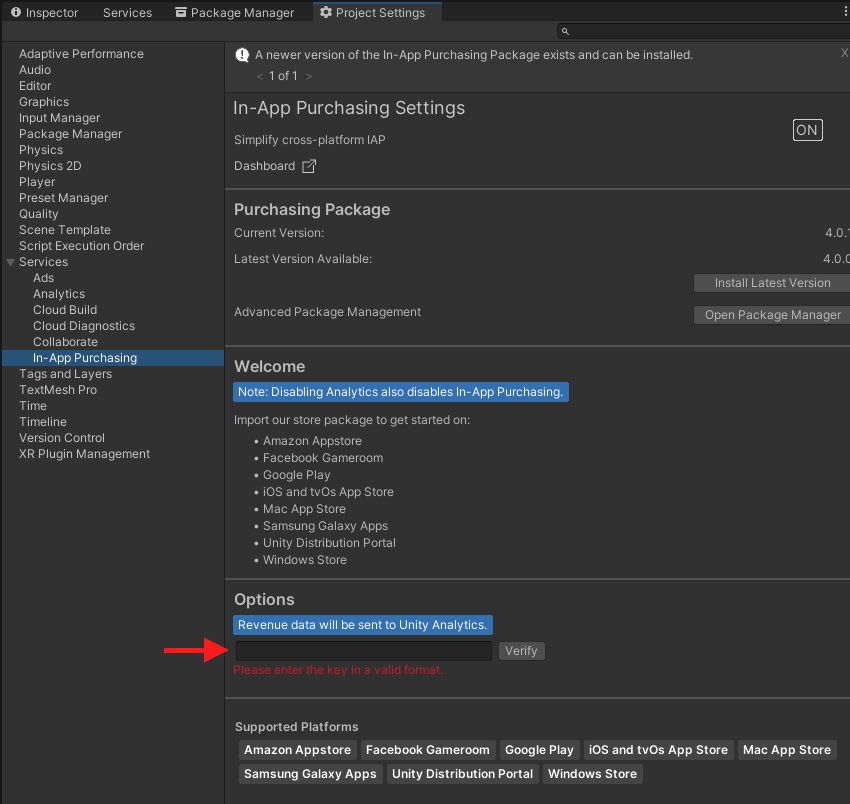
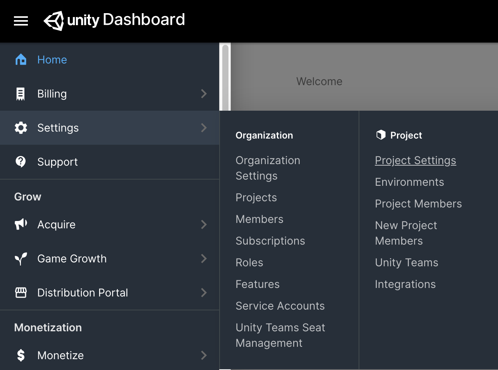
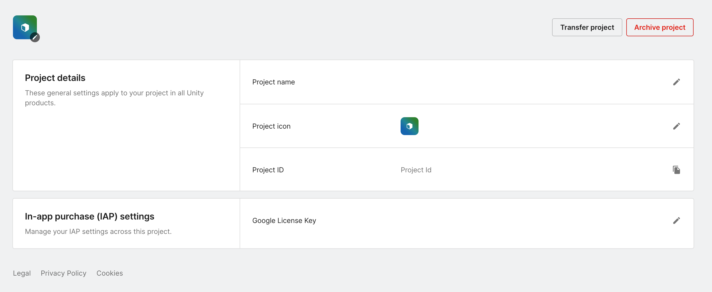

# Setting Google Public Key

It is possible to set the Google Public Key in two different places either in the Unity Editor or in the Project Setting in the dashboard.

## In Unity Editor

1. Follow the steps in [Getting Started Guide](../../SetupIAP/GettingStarted.md) to go to the In-App Purchasing service window
2. Follow the steps to enter the Google Public Key in the `Options` section of the In-App Purchasing service window

## In project dashboard

1. Go to the [Unity Dashboard](https://dashboard.unity3d.com/landing)
2. Open the left menu and select `Settings` then `Project Settings` under `Project`
 and select the project
3. In the section `In-app purchase (IAP) settings` edit the field `Google License Key`
