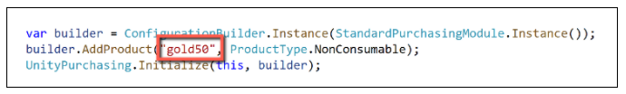
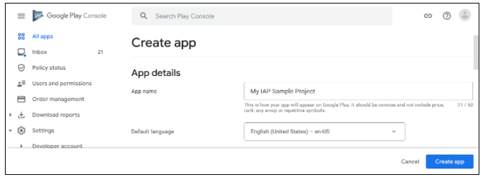
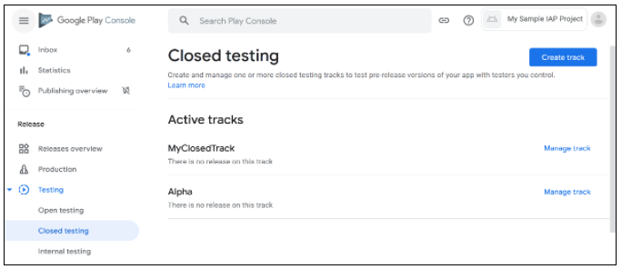
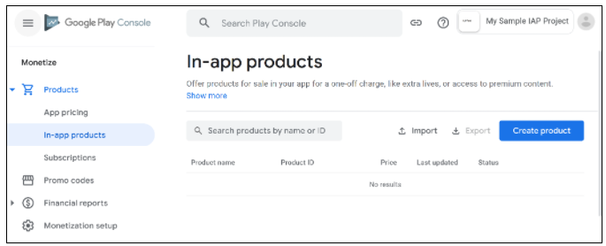
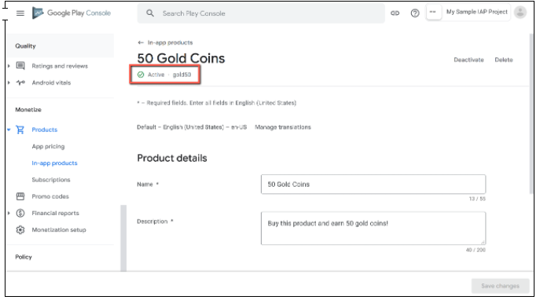
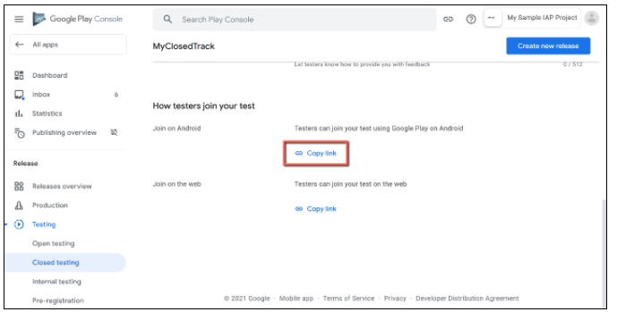
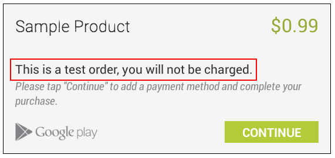

# How to Set Up

## Introduction

This guide describes the process of establishing the digital records and relationships necessary for a Unity game to interact with an In-App Purchase Store. 

In-App Purchase (IAP) is the process of transacting money for digital goods. A platform's Store allows the purchase of Products, representing digital goods. These Products have an Identifier, typically of string datatype. Products have Types to represent their durability: _subscription_, _consumable_ (capable of being rebought), and _non-consumable_ (capable of being bought once) are the most common. 

## Google Play Store

### Getting Started

1. Write a game implementing Unity IAP. See [Unity IAP Initialization](../../SetupIAP/Overview.md) and [the Sample IAP Project](https://forum.unity.com/threads/sample-iap-project.529555/).

2. Keep the game's product identifiers on-hand for Google Play Developer Console use later. 

    

3. Build a signed non-Development Build Android APK from your game. 

    **TIP:** Make sure you safely store your keystore file. The original keystore is always required to update a published Google Play application. 

    **TIP:** Reuse the Bundle Version Code from your last uploaded APK during local testing to permit side-loading without first being required to upload the changed APK to the Developer Console. See the settings for the Android platform Player.

### Register the Application

From the Google Account that will publish the game, register the Android application with the [Google Play Developer Console](https://play.google.com/apps/publish).

**NOTE:** This guide uses the [Google Play License Testing approach](http://developer.android.com/google/play/billing/billing_testing.html) for testing in-app purchase integration. 

1. Choose __Create app__.

    

2. Give the application an App name and select the appropriate options for your game. 

    

3. Navigate to __Testing/Closed testing__ in the left nav and choose __Create track__. Select your APK and upload it. Also complete the basic Dashboard requirements, upload screenshots and add a Short and Full description. You can also create an Internal test track.

    

### Add In-App Purchases

Now that you have uploaded our first binary, you can add the IAP products.

1. Navigate to __In-app Products__ and choose __Create product__.

    

2. Define the __Product ID__ , product details and price. Remember to activate the product after saving. 

    You can specify a consumable or non-consumable Product Type in __Managed product__. __Subscription__ is also supported by Unity IAP.

**NOTE**: The "Product ID" here is the same identifier used in the game source code, added to the [Unity IAP ConfigurationBuilder] instance via `AddProduct()` or `AddProducts()`, like "gold50". 

### Test IAP

Add your testers to License Testing. 

1. Navigate to All Apps on your Google Developer dashboard. 

2. Select __Settings/License Testing__. Add each Google Account email address. Save changes. 

  

    NOTE: There may be a delay of several hours from the time you publish the APK. 
    
3. When available, share the __Join on Android__ link with testers. Ensure that testers can install the application from the store.

__Note:__ To test updates retaining permission to purchase IAPS's for free, you may side-load applications, updating the existing store-downladed APK install.

4. To test the IAP, make a purchase on a device logged in with a Tester Google Account. A modified purchase dialog box appears to confirm the fact this product is under test and is free.

    **WARNING**: If this dialog box does not appear, then the Tester Google Account will be charged real money for the product.
  
    
