# How to Set Up

## Introduction

This guide describes the process of establishing the digital records and relationships necessary for a Unity game to interact with an In-App Purchase Store.

In-App Purchase (IAP) is the process of transacting money for digital goods. A platform's Store allows purchase of Products representing digital goods. These Products have an Identifier, typically of string datatype. Products have Types to represent their durability: _subscription_, _consumable_ (capable of being rebought), and _non-consumable_ (capable of being bought once) are the most common. 

## Windows Store

### Introduction

Windows App Development offers both local and remote Windows Store client-server IAP testing. 

This page covers local testing with the emulator and a simulated billing system, then Windows Store testing which limits app publication visibility to those with the app's link. 

**NOTE**: This guide targets Windows 10 Universal SDK. Other Windows targets are available.

**NOTE**: Unity versions 5.6+ support IL2CPP Windows builds. Using Unity IAP for IL2CPP on Windows with earlier versions of Unity generates a compilation error.

### Getting started

1. Write a game implementing Unity IAP. See [Unity IAP Initialization](../../SetupIAP/Overview.md).

1. Keep the game's product identifiers on-hand for use in Microsoft's Windows Dev Center Dashboard to perform remote Windows Store testing later. 

  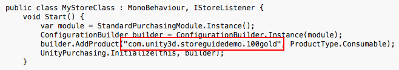

### Test IAP locally

Microsoft offers a simulated billing system, permitting local testing of IAP. This removes the need to configure anything on the Windows Dev Center or communicate with the the Windows Store via the app for initial integration testing. 

[Configuring local testing](UnityIAPUniversalWindows.md) is far simpler than for remote Store testing, although it requires temporary code changes to the app which need to be removed before app publication. 

To test IAP locally:

1. Enable the simulated billing system in code where Unity IAP is initialized with its ConfigurationBuilder instance. 

    **WARNING**: Remove these code changes after testing, before publishing to the Store; otherwise the app will not transact any real money via IAP!

    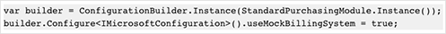

2. Build the application in Unity for __Universal Windows Platform__.

3. Open the application in Visual Studio and run the Local Machine target for x86.

4. Test IAP.

5. Remove the simulated billing system from code.

### Register the App on the Windows Store

Once basic IAP functionality has been tested locally, you can more confidently begin working with the Windows Store. This test confirms that the app has all necessary IAPs registered correctly to permit purchasing.

For testing IAP and publication use the [Windows Dev Center](https://dev.windows.com/en-us/publish) and configure the app with a limited visibility. This limits the app's visibility to those who have its direct link. 

**NOTE**: Testing on the Store also requires Certification, which may serve as an obstacle to testing. It is therefore important to complete testing locally before proceeding to testing with Windows Store.

1. In the Dev Center [create a new app](https://dev.windows.com/en-us/overview).

    

2. Reserve the app name. 

    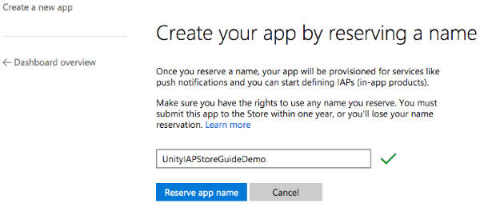

3. To test IAP with the Windows Store, the Windows Dev Center needs the published app. Click __Pricing and availability__  and limit the app's Store visibility so that it is only available to users who have the app's direct link.

    

4. In "Distribution and visibility" see a list of the Store's available [publication behaviors](https://msdn.microsoft.com/en-us/library/windows/apps/mt148548.aspx#dist_vis). Select __Hide this app in the Store__. 

    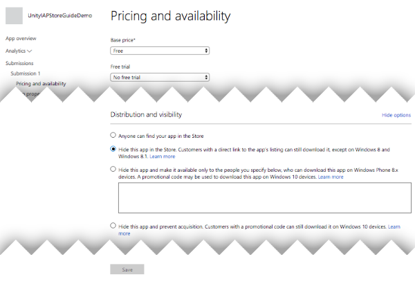

5. Collect the direct link. This will be used to install the app on a Windows 10 device for [testing](https://msdn.microsoft.com/en-us/library/windows/apps/mt148561.aspx). 

    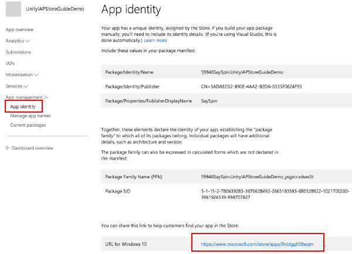

6. Submit the app for Certification. 

    Submissions may take many hours to complete, and blocking issues may be raised by Microsoft Certification, which you will need to address before the submission passes successfully.

### Add In-App Products on the Store

Add each IAP, setting the price to be "free" so that no money will be transacted during testing. After the test is completed, reconfigure the IAP with the desired price and republish it. See [IAP Submissions](https://msdn.microsoft.com/en-us/library/windows/apps/mt148551.aspx). 

1. In the new app's "App overview" page, click __Create a new IAP__ .

    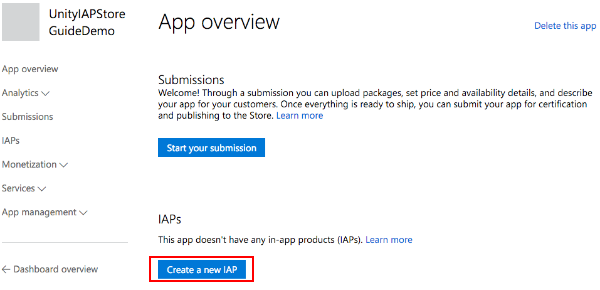

2. Enter the product ID.

    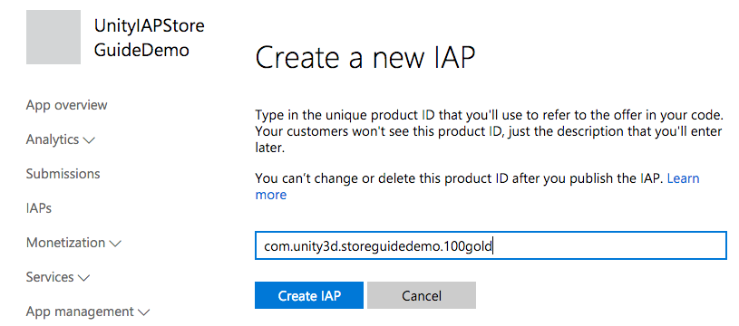

3. Configure the type, price, and language. 

    **NOTE**: For **Pricing and availability** choose **free** for testing purposes to avoid incurring unnecessary financial charges. When you're finished with testing, update and re-submit each IAP with the desired price in preparation for release to the public.

    

    Select **Properties** to set the type.

    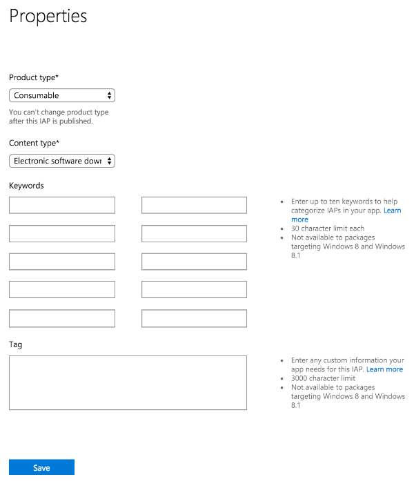

    Select **Pricing and availability** to set the price choosing **Free** as explained above.

     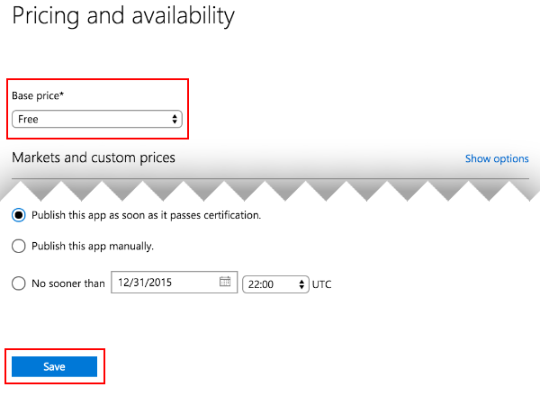

    Select **Manage languages** and declare the supported languages.

    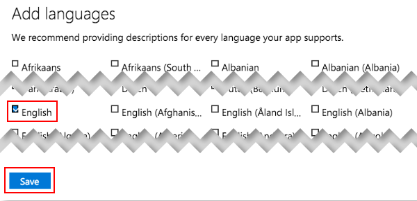

    Select the declared language when returned to the IAP overview.

    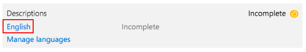
 
    Populate the Title, Description and Icon. 

    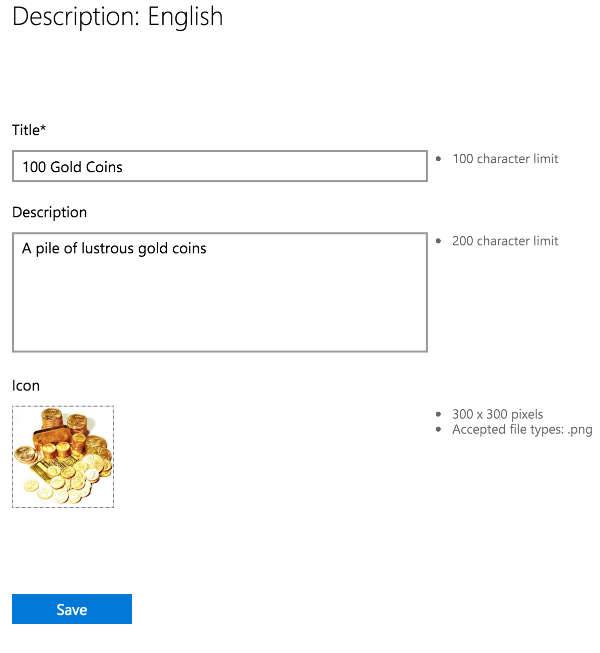

4. Submit the IAP for Certification. 

    As with apps, IAP submissions may take many hours to complete, and blocking issues may be raised by Microsoft Certification which you will need to address before the submission passes successfully.

    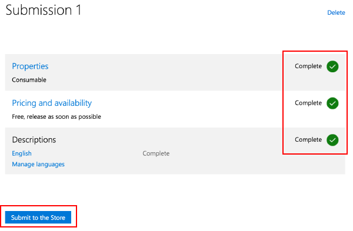

### Test IAP with the Store

These steps follow a branch of the beta test process made possible with Windows Store. This involves limiting the visibility of the app itself, negating discovery by the public through the "Search Store" function. See Windows Dev Centre resources on [beta testing](https://msdn.microsoft.com/en-us/library/windows/apps/xaml/mt188751.aspx) and [targeted distribution](https://msdn.microsoft.com/en-us/library/windows/apps/mt185377.aspx) for more information.

1. Confirm both the app and IAPs have completed Certification.

2. Install the app on a Windows 10 device via the direct link, generated above.

3. Test IAP.

4. After passing test, update the IAP with the desired public pricing, update the app visibility settings to share with the general public, and submit both kinds of changes for final Certification.

